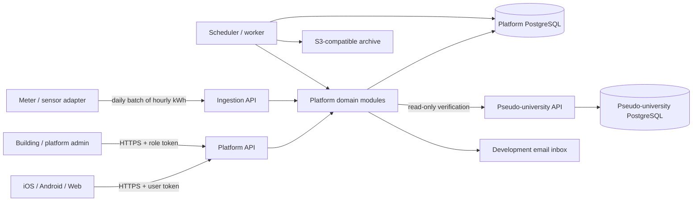

# Energy Leaderboard Platform Design

**Status:** Proposed  
**Requirements:** `spec.md`  
**Architecture style:** Modular services with explicit adapters and PostgreSQL-backed transactional boundaries

## System shape



The platform API, ingestion routes, and scheduled worker may initially share one deployable Python codebase. They remain separate modules and processes so ingestion, query traffic, and scheduled calculations can scale independently later. The pseudo-university service owns a separate database and deployment boundary.

## Module boundaries

| Module | Owns | Does not own |
|---|---|---|
| Identity | email challenges, accounts, usernames, roles, tokens | residence truth |
| University adapter | roster verification and residence synchronization | direct access to university tables |
| Topology | universities, buildings, apartments, rooms, fuse boxes, meters, effective assignments | raw readings |
| Ingestion | meter authentication, batch validation, idempotency, quarantine entry | occupancy or leaderboard math |
| Usage calculation | fuse-box/apartment hourly facts, completeness, occupancy snapshots, participant allocation | ranking policy |
| Competition | windows, eligibility, scores, ranks, snapshots, finalization | mutation of raw readings |
| Administration | topology operations, anomaly review, correction workflow, moderation | bypassing audit rules |
| Archival | semester export, manifests, verification, purge eligibility | competition calculations |
| Pseudo-university | synthetic students, enrolment, residence, read-only verification API | platform authentication or ranking |

Each module exposes application services and repository interfaces. HTTP handlers and scheduled jobs call those services; they do not contain domain calculations.

## Proposed technology

- PostgreSQL for transactional and analytical persistence.
- FastAPI for platform and pseudo-university HTTP APIs.
- SQLAlchemy 2.x and Alembic for persistence and migrations.
- Pydantic models at HTTP/configuration boundaries; domain calculations use explicit decimal/date types.
- A PostgreSQL-backed job table plus worker process for the demo. The scheduler adapter enqueues local-time university jobs without coupling domain logic to a particular queue vendor.
- pytest with unit, database integration, API contract, and end-to-end suites.
- Docker Compose for the platform database, university database, API, worker, pseudo-university service, development inbox, and S3-compatible object storage.

Exact supported versions will be pinned during implementation after checking current official documentation.

## Data model

All mutable business tables include `created_at`, `updated_at`, and an optimistic version where concurrent administration can conflict. Tenant-owned records carry `university_id`; foreign keys and repository filters enforce tenant scope.

### Identity and tenancy

- `university`: tenant ID, name, IANA timezone, status, semester policy.
- `university_email_domain`: approved normalized domains.
- `user_account`: private platform identity and lifecycle state.
- `university_identity`: user, university, normalized verified email, external student reference, enrolment state.
- `email_challenge`: hashed code, expiry, attempts, consumed time.
- `user_profile`: university-scoped username and moderation state.
- `role_assignment`: participant, building administrator, or platform administrator with optional building scope.
- `audit_event`: tenant, actor, action, target, reason, before/after JSON, request correlation, timestamp.

### Residence and topology

- `building`: university and public display name.
- `apartment`: building and administrative label.
- `room`: apartment and private administrative label.
- `residence_membership`: university identity, room, accounting-effective start/end, upstream source version.
- `fuse_box`: physical fuse-box identity and operational state.
- `fuse_box_apartment_assignment`: fuse box, apartment, effective start/end.
- `meter`: sensor identity, credential hash, revoked time, operational state.
- `meter_fuse_box_assignment`: meter, fuse box, effective start/end.

Database exclusion constraints or equivalent transaction checks prevent overlapping active assignments for the same membership, fuse box, or meter.

### Measurement and integrity

- `meter_hourly_reading`: meter, `hour_start_utc`, accepted kWh decimal, `received_at`, status, credential provenance; unique on `(meter_id, hour_start_utc)`.
- `reading_submission`: batch-level request metadata, result counts, credential, and correlation ID.
- `reading_correction`: reading, proposed/replacement kWh, reason, actor, status, decision actor/time.
- `reading_anomaly`: reading or proposed reading, rule, observed value, threshold, status, decision provenance.

An identical retry reads the existing row. A changed duplicate creates a correction/anomaly workflow; it never updates the accepted kWh silently.

### Calculated hourly facts

- `fuse_box_hourly_usage`: fuse box, apartment, hour, accepted energy kWh, `apartment_occupant_count`, `energy_kwh_per_pax`, unallocated flag, source reading/version, calculation version.
- `apartment_hourly_usage`: apartment, hour, total kWh, occupant count, per-person kWh, unallocated kWh, expected fuse-box count, received fuse-box count, completeness, occupancy snapshot time/version, calculation version.
- `participant_hourly_allocation`: apartment-hour fact, university identity, room membership, allocated kWh, calculation version.

Unique keys make each calculation version idempotent. Calculated rows are replaced only before a result is finalized and retain provenance to the raw reading and occupancy source used.

### Competition

- `competition_period`: university, local/UTC window boundaries, kind, state (`open`, `pending`, `finalized`).
- `leaderboard_snapshot`: building, current/previous UTC windows, calculated time, status (`fresh`, `stale`, `pending`, `finalized`), source watermark, calculation version.
- `leaderboard_entry`: snapshot, participant, captured username, apartment, prior/current attributed kWh, prior/current average daily kWh, improvement percentage, absolute reduction, coverage values, eligibility state/reason, rank.
- `scheduled_job_run`: university-local job key, intended boundary, start/end, state, error summary, retry count.

Finalization occurs transactionally: lock the pending snapshot, verify its source watermark and correction deadline, capture usernames, assign final state, and reject future mutation through application and database guards.

### Archival

- `semester`: university, local boundaries, state.
- `archive_manifest`: semester, schema version, object keys, checksums, row counts, export/verification timestamps, state.

Operational deletion is a separate transaction/job that requires a verified manifest. Failure cannot remove source records.

## Core invariants

1. A raw reading belongs to exactly one meter-hour and is never counted twice.
2. A meter resolves to at most one fuse box and a fuse box to at most one apartment for a measured hour.
3. Occupancy is derived from effective residence records at the local accounting boundary.
4. For a complete occupied apartment-hour, the sum of participant allocations equals apartment kWh within fixed decimal tolerance.
5. Zero-occupant usage is retained as unallocated and never divided.
6. Missing any expected fuse box makes the apartment-hour incomplete.
7. Incomplete hours reduce coverage; they never masquerade as zero usage.
8. Ranking is building-scoped and cannot join private data from another tenant.
9. A finalized snapshot is immutable; anonymization changes display identity through a controlled tombstone without changing score or rank.
10. No external client receives database credentials or direct database access.

## Time and calculation model

All persisted instants are timezone-aware UTC. University-local boundaries are generated from the university's IANA timezone, then converted to UTC. Date arithmetic occurs on local boundaries before conversion so daylight-saving transitions remain correct.

For a cutoff `C` after Monday 08:00 local:

```text
current_window  = [current Monday 08:00, C)
previous_window = [previous Monday 08:00, C - 7 local days)
elapsed_days    = exact local competition duration / 24 hours for display

previous_average_daily_kwh = previous_attributed_kwh / elapsed_days
current_average_daily_kwh  = current_attributed_kwh / elapsed_days
improvement_percent        =
    (previous_average_daily_kwh - current_average_daily_kwh)
    / previous_average_daily_kwh * 100
```

The calculation service uses fixed-precision `Decimal`. Eligibility is evaluated before ranking:

- positive previous average;
- at least 95% complete apartment-hours in both windows;
- participant has a full baseline since the last apartment change;
- apartment membership and occupancy roster remain unchanged across both windows;
- no unresolved quarantined reading affects either window.

Eligible entries are sorted by improvement percentage descending, absolute reduction descending, and current attributed kWh ascending. Exact equality across all keys receives standard competition rank. All entries may be displayed, but ineligible entries have null rank and an explicit reason. No winner is declared unless rank 1 has positive improvement.

## Main workflows

### Daily ingestion

1. Authenticate the meter credential and resolve active assignment.
2. Validate a maximum of 24 UTC-hour records and reject malformed values atomically at record level.
3. Upsert by meter-hour: identical values are idempotent; changed values enter correction review.
4. Apply anomaly rules and quarantine suspect values.
5. Enqueue affected fuse-box and apartment hours for recalculation.
6. Return per-record accepted, duplicate, quarantined, or rejected outcomes.

### Hourly calculation

1. Resolve each accepted meter reading to its effective fuse box and apartment.
2. Resolve the active apartment occupancy roster and store its count/version.
3. Calculate fuse-box usage and optional per-pax value.
4. Resolve all expected active fuse boxes for the apartment-hour.
5. Sum present accepted readings and mark completeness.
6. If complete and occupied, store equal participant allocations; otherwise preserve incomplete or unallocated facts without allocation.

### Daily leaderboard

1. At each university's local 08:00, enqueue one job per building with a unique intended cutoff.
2. Resolve matching current and previous windows.
3. Aggregate participant allocations and coverage.
4. Apply eligibility, score, tie, and winner rules.
5. Write an immutable snapshot version and publish it by 08:05.
6. On failure, retain the prior successful snapshot, mark the served response stale, and emit an alert signal.

### Weekly closure

1. Monday 08:00 snapshot enters `pending` with a Tuesday 08:00 deadline.
2. Approved corrections before the deadline produce new pending snapshot versions.
3. Tuesday 08:00 finalization locks the selected version, captures usernames, and makes score/rank immutable.
4. Later readings remain available for consumption history but cannot change that finalized competition.

### Residence synchronization and moves

1. Verify the university email and fetch the authoritative roster record.
2. Translate an upstream move into an effective local 08:00 membership boundary.
3. Close the old membership, open the new membership, and invalidate affected provisional calculations.
4. Preserve historical allocations and finalized entries.
5. Mark the participant baseline-incomplete until a full baseline week exists in the new apartment.

### Semester archive

1. Freeze the semester for archival after its competition results are finalized.
2. Export tenant-partitioned data and metadata to versioned objects.
3. Generate counts and cryptographic checksums in a manifest.
4. Independently read and verify exported objects.
5. Mark the manifest verified; only then enqueue operational deletion according to policy.

## API outline

### Platform client

- `POST /v1/auth/challenges`
- `POST /v1/auth/challenges/verify`
- `GET /v1/me`
- `PATCH /v1/me/username`
- `GET /v1/me/usage/hourly`
- `GET /v1/me/usage/daily`
- `GET /v1/me/usage/weekly`
- `GET /v1/buildings/{building_id}/leaderboard/current`
- `GET /v1/buildings/{building_id}/leaderboards`
- `GET /v1/buildings/{building_id}/leaderboards/{snapshot_id}`

### Meter ingestion

- `POST /v1/meters/readings:batch`

### Administration

- topology and effective assignment resources under `/v1/admin/...`
- anomaly queue and decisions under `/v1/admin/anomalies/...`
- corrections under `/v1/admin/corrections/...`
- residence synchronization under `/v1/admin/residence-sync/...`
- archive jobs and manifests under `/v1/admin/semesters/...`

### Operations

- `GET /health/live`
- `GET /health/ready`
- `GET /metrics` on an access-restricted operations listener or route

Identifiers are opaque UUIDs. Collection endpoints are cursor-paginated. Mutation endpoints accept an idempotency key where client retry can occur.

## Security and privacy

- Passwordless email challenges store only a keyed hash of the code and enforce expiry, attempt, and rate limits.
- User access tokens are short-lived; refresh/session handling is revocable.
- Meter credentials are randomly generated, shown once, stored hashed, independently revocable, and rate-limited.
- Authorization is checked in application services as well as route dependencies.
- Tenant identifiers come from authenticated context, not untrusted request bodies.
- Private residence and email fields never appear in leaderboard serializers or structured logs.
- Administrator changes require a reason and append an audit event in the same transaction.
- The pseudo-university service exposes only the verification fields needed by the platform.

## Demo deployment and seeds

Docker Compose starts:

1. platform PostgreSQL;
2. platform API;
3. scheduled worker;
4. pseudo-university PostgreSQL;
5. pseudo-university API;
6. development email inbox;
7. S3-compatible object storage;
8. optional static API demonstration page.

The seed generator creates deterministic tenants, buildings, apartments, rooms, occupants, fuse boxes, meters, 13 weeks of hourly kWh, moves, zero-occupant hours, missing fuse-box readings, anomalies, ties, non-improvers, and positive winners. Seed generation uses the same public ingestion and university interfaces where practical.

## Testing strategy

- Pure domain tests for time windows, decimal allocation, coverage, eligibility, score, ties, and winner rules.
- PostgreSQL integration tests for uniqueness, exclusion constraints, tenant scoping, effective assignments, audit atomicity, and immutable finalization.
- API tests for authentication, authorization, privacy-safe serialization, ingestion outcomes, pagination, and OpenAPI schema.
- Contract tests between platform and pseudo-university API.
- Scheduler tests across timezones and daylight-saving transitions.
- End-to-end scenarios covering daily ingestion through Tuesday finalization and semester archival.
- Fault-injection tests for missing fuse boxes, duplicate/changed readings, dependency failure, stale snapshots, and archive verification failure.

## Known trade-offs

- Equal allocation is transparent but cannot prove individual behavior. The UI must preserve that wording.
- PostgreSQL can support the demo scale without a separate analytical store; partitioning meter readings by time and university keeps an upgrade path open.
- A database-backed worker is operationally simple for the demo. Explicit scheduler/job interfaces permit later migration to a managed queue.
- A 24-hour finalization delay prioritizes correctness over immediately declaring a permanent Monday winner.

