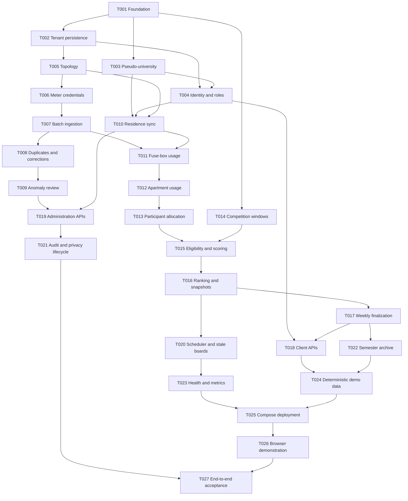

# Energy Leaderboard Platform Execution Plan

**Status:** Proposed  
**Branch of record:** `conrad`  
**Team:** One Tech Lead and five Software Engineers  
**Task rule:** One checked task and its traceability updates per atomic Conventional Commit

## Operating contract

1. The Tech Lead owns interfaces, dependency order, merge readiness, risk decisions, and final acceptance. The Tech Lead does not author production feature code, preserving independence for final verification.
2. Each engineer owns a disjoint module lane. Cross-lane interfaces are changed only through a Tech Lead-approved contract update.
3. Every task begins with tests derived from the listed acceptance criteria. Tests assert specified outcomes rather than mirror implementation structure.
4. A task is complete only when its listed gate passes. The task checkbox and traceability evidence are updated before, and included in, the same commit.
5. Every task produces one Conventional Commit. No task batches, skipped tests, weakened assertions, pushes, deployments, or production changes are authorized.
6. Parallel work uses engineer-specific worktrees/branches derived from `conrad`; the Tech Lead integrates task commits into `conrad` in dependency order after their gates pass.
7. Engineers do not resolve integration conflicts by changing another lane's behavior. They report the contract conflict to the Tech Lead.
8. After the last implementation commit, the Tech Lead is re-instantiated with fresh context as the author-independent Verifier. It re-derives acceptance coverage, performs behavior-level fault injection in disposable copies, and writes `validation.md`.

## Team lanes

| Role | Ownership | Review partner |
|---|---|---|
| Tech Lead | contracts, decision log, task dispatch, integration queue, final verification | User for scope; fresh verifier pass for evidence |
| Engineer 1 — Identity | repository foundation, tenancy, authentication, pseudo-university integration, privacy | Engineer 4 |
| Engineer 2 — Ingestion | physical topology, meter credentials, batch ingestion, anomalies and corrections | Engineer 3 |
| Engineer 3 — Usage | residence synchronization, occupancy snapshots, fuse-box/apartment calculation, participant allocation | Engineer 2 |
| Engineer 4 — Competition | time windows, eligibility, scoring, snapshots, finalization, participant query APIs | Engineer 1 |
| Engineer 5 — Platform | administration, scheduler/observability, archive, seeds, demo, end-to-end harness | Engineer 4 |

Review partners inspect contract use and test intent; they do not replace the final independent verification.

## Dependency graph

## Wave plan

- **Wave 0 — Contract lock:** Tech Lead approves spec/design/tasks; Engineer 1 completes T001. No other implementation begins before its gate.
- **Wave 1 — Independent foundations:** Engineer 1 runs T002–T004; Engineer 2 runs T005–T009 after the indicated contracts; Engineer 4 may run pure T014; Engineer 5 prepares no production behavior outside approved contracts.
- **Wave 2 — Domain core:** Engineer 3 runs T010–T013 while Engineer 4 continues T015 after required usage contracts become available. Engineer 5 may begin T020's scheduler adapter only after snapshot interfaces are locked.
- **Wave 3 — Product surfaces:** Engineer 4 runs T016–T018; Engineer 5 runs T019–T023 as dependencies land; Engineer 1 supports privacy review without changing lane ownership.
- **Wave 4 — Demo and system gate:** Engineer 5 runs T024–T027. Other engineers address only gaps in their own lanes through newly recorded fix tasks.
- **Wave 5 — Independent verification:** Fresh Tech Lead verifier runs the full spec-anchored and discrimination checks. FAIL creates atomic fix tasks and repeats verification, bounded to three iterations.

## Tasks

### Foundation and identity lane

- [ ] **T001 — Create the reproducible Python service foundation**
  - **Owner:** Engineer 1
  - **Depends on:** None
  - **Requirements:** REQ-NFR-003, REQ-NFR-004, REQ-NFR-005
  - **Work:** Establish platform and pseudo-university packages, dependency/configuration management, lint/type/test commands, migration entry points, and module-boundary skeletons without feature behavior.
  - **Tests:** Smoke-import both applications; configuration rejects missing required settings; test discovery succeeds.
  - **Gate:** Formatting, linting, type checking, and empty/smoke test suites pass from documented commands.
  - **Commit:** `build(platform): establish reproducible service foundation`

- [ ] **T002 — Implement tenant-aware persistence foundation**
  - **Owner:** Engineer 1
  - **Depends on:** T001
  - **Requirements:** REQ-TEN-001, REQ-NFR-001, REQ-NFR-002
  - **Work:** Add university, email-domain, account, profile, role, and audit foundations; define UUID, UTC, decimal, transaction, and tenant-context conventions.
  - **Tests:** Cross-tenant repository access fails; decimal and timezone values round-trip; platform-admin override is explicit and audited.
  - **Gate:** Identity persistence integration suite passes against PostgreSQL.
  - **Commit:** `feat(identity): add tenant-aware persistence foundation`

- [ ] **T003 — Build the isolated pseudo-university service**
  - **Owner:** Engineer 1
  - **Depends on:** T001
  - **Requirements:** REQ-UNI-001
  - **Work:** Create separate database/schema ownership, enrolment and effective residence models, read-only verification API, deterministic seed interface, and platform client contract.
  - **Tests:** Verification returns active/inactive/no-match cases; platform database code cannot import university persistence; API contract tests pass.
  - **Gate:** Pseudo-university unit, migration, API, and consumer contract tests pass.
  - **Commit:** `feat(university): add isolated roster verification service`

- [ ] **T004 — Implement passwordless identity, roster activation, usernames, and roles**
  - **Owner:** Engineer 1
  - **Depends on:** T002, T003
  - **Requirements:** REQ-ID-001, REQ-ID-002, REQ-ID-003, REQ-TEN-001
  - **Work:** Add expiring one-time challenges, university-domain validation, roster activation, token/session issuance, university-unique usernames, moderation state, and role authorization primitives.
  - **Tests:** All AC-ID-001/002 cases; username privacy and uniqueness; rate/attempt limits; participant/building/platform role matrix; sensitive fields absent from logs.
  - **Gate:** Identity API and authorization suites pass with privacy snapshot assertions.
  - **Commit:** `feat(identity): verify university residents and issue scoped access`

### Topology and ingestion lane

- [ ] **T005 — Model dorm topology and effective physical assignments**
  - **Owner:** Engineer 2
  - **Depends on:** T002
  - **Requirements:** REQ-TOP-001
  - **Work:** Add buildings, apartments, rooms, fuse boxes, meters, effective fuse-box/apartment assignments, and meter/fuse-box assignments with overlap protection.
  - **Tests:** Multiple rooms/fuse boxes per apartment; overlap rejection; exact-boundary replacement; tenant isolation; historical resolution.
  - **Gate:** Topology migration and PostgreSQL constraint tests pass.
  - **Commit:** `feat(topology): model apartments fuse boxes and meter assignments`

- [ ] **T006 — Add independently revocable meter credentials**
  - **Owner:** Engineer 2
  - **Depends on:** T005
  - **Requirements:** REQ-ING-001, REQ-NFR-002
  - **Work:** Provision, hash, authenticate, rotate, revoke, and rate-limit meter credentials without exposing resident authorization paths.
  - **Tests:** Active credential succeeds; revoked/wrong/tenant-mismatched credentials fail; raw secret is never persisted or logged.
  - **Gate:** Meter-auth security and integration tests pass.
  - **Commit:** `feat(ingestion): authenticate revocable meter credentials`

- [ ] **T007 — Persist validated hourly batches idempotently**
  - **Owner:** Engineer 2
  - **Depends on:** T006
  - **Requirements:** REQ-ING-001, REQ-ING-002, REQ-NFR-001
  - **Work:** Implement the maximum-24-record endpoint, UTC-hour and decimal validation, server `received_at`, submission provenance, unique meter-hour persistence, and per-record outcomes.
  - **Tests:** Valid 24-hour batch; malformed/negative/future/non-hour inputs; mixed outcomes; concurrent identical retries produce one reading.
  - **Gate:** Ingestion API, concurrency, and database uniqueness suites pass.
  - **Commit:** `feat(ingestion): accept idempotent hourly energy batches`

- [ ] **T008 — Route changed duplicates through immutable corrections**
  - **Owner:** Engineer 2
  - **Depends on:** T007
  - **Requirements:** REQ-ING-002, REQ-ADM-001
  - **Work:** Detect changed meter-hour values, create correction proposals with before/after provenance, and prevent silent accepted-value updates.
  - **Tests:** Identical retry is no-op; changed retry creates one proposal; concurrent changes are serialized; accepted reading remains unchanged.
  - **Gate:** Correction state-machine and audit-atomicity tests pass.
  - **Commit:** `feat(ingestion): audit changed duplicate readings`

- [ ] **T009 — Implement configurable anomaly quarantine**
  - **Owner:** Engineer 2
  - **Depends on:** T008
  - **Requirements:** REQ-ING-003, REQ-ADM-001
  - **Work:** Add structural validation rules, tenant/building thresholds, quarantine lifecycle, approval/rejection commands, and calculation invalidation events.
  - **Tests:** Impossible rejection, threshold quarantine, exclusion before approval, inclusion after approval, rejection, and audit evidence.
  - **Gate:** Anomaly rule and lifecycle integration suites pass.
  - **Commit:** `feat(ingestion): quarantine suspicious energy readings`

### Usage calculation lane

- [ ] **T010 — Synchronize effective residence at local accounting boundaries**
  - **Owner:** Engineer 3
  - **Depends on:** T003, T004, T005
  - **Requirements:** REQ-RES-001, REQ-ID-002
  - **Work:** Consume university residence records, translate actual moves to next local 08:00 accounting boundaries, prevent overlapping memberships, and record upstream versions.
  - **Tests:** Initial residence, same-building and cross-building moves, boundary timing, historical lookup, idempotent resync, and unavailable university service.
  - **Gate:** Residence synchronization and timezone integration suites pass.
  - **Commit:** `feat(residence): synchronize effective apartment membership`

- [ ] **T011 — Calculate fuse-box hourly usage with occupancy snapshots**
  - **Owner:** Engineer 3
  - **Depends on:** T007, T010
  - **Requirements:** REQ-CALC-001, REQ-TOP-001
  - **Work:** Resolve effective assignments and occupancy, calculate fuse-box per-pax values, preserve zero-occupant unallocated energy, and store source/calculation versions.
  - **Tests:** One/multiple occupants, zero occupants, meter replacement, assignment boundary, fixed decimal precision, and idempotent recalculation.
  - **Gate:** Fuse-box calculation unit and PostgreSQL provenance tests pass.
  - **Commit:** `feat(usage): calculate fuse box hourly consumption`

- [ ] **T012 — Aggregate complete apartment hourly usage**
  - **Owner:** Engineer 3
  - **Depends on:** T011
  - **Requirements:** REQ-CALC-002
  - **Work:** Resolve expected active fuse boxes, sum accepted usage, store counts/completeness/occupancy snapshots, and preserve incomplete or unallocated states.
  - **Tests:** Multiple fuse boxes, one missing, quarantined source, zero occupants, corrected source before finalization, and exact sum precision.
  - **Gate:** Apartment aggregation and completeness suites pass.
  - **Commit:** `feat(usage): aggregate apartment hourly consumption`

- [ ] **T013 — Materialize equal participant hourly allocations**
  - **Owner:** Engineer 3
  - **Depends on:** T012
  - **Requirements:** REQ-CALC-003, REQ-NFR-001
  - **Work:** Store participant allocations for complete occupied hours, link membership and occupancy provenance, and enforce conservation within decimal tolerance.
  - **Tests:** Equal allocation for varied occupancy; allocation sum conservation; incomplete/zero-occupant exclusion; move boundary; recalculation idempotency.
  - **Gate:** Allocation property tests and persistence integration tests pass.
  - **Commit:** `feat(usage): allocate apartment energy equally per resident`

### Competition and query lane

- [ ] **T014 — Implement university-local competition windows**
  - **Owner:** Engineer 4
  - **Depends on:** T001
  - **Requirements:** REQ-COMP-001
  - **Work:** Build pure window functions for Monday 08:00 weeks, daily cumulative cutoffs, matching previous periods, and UTC conversion through IANA timezones.
  - **Tests:** Monday/Thursday examples, exact inclusivity, multiple timezones, daylight-saving gaps/folds, and year/semester boundaries.
  - **Gate:** Deterministic window unit suite passes without database access.
  - **Commit:** `feat(competition): define local cumulative comparison windows`

- [ ] **T015 — Evaluate eligibility and improvement scores**
  - **Owner:** Engineer 4
  - **Depends on:** T013, T014
  - **Requirements:** REQ-COMP-002, REQ-COMP-003
  - **Work:** Aggregate attributed kWh/coverage, enforce positive baseline, stable roster and post-move baseline, calculate decimal averages/percentage, and expose explicit ineligibility reasons.
  - **Tests:** Formula examples; zero baseline; 94.99/95% coverage boundary; missing fuse box; roster change; apartment move; unchanged apartment.
  - **Gate:** Score and eligibility unit/property suites pass.
  - **Commit:** `feat(competition): calculate eligible improvement scores`

- [ ] **T016 — Rank building entries and persist daily snapshots**
  - **Owner:** Engineer 4
  - **Depends on:** T015
  - **Requirements:** REQ-COMP-004, REQ-COMP-005
  - **Work:** Apply ordered tie-breakers and standard competition ranks, determine winner/no-winner, capture source watermarks, and write immutable snapshot versions.
  - **Tests:** Exact ties (`1,1,3`), non-exact tie-breaks, negative/no winner, same-apartment shared score, building isolation, deterministic rerun.
  - **Gate:** Ranking and snapshot persistence suites pass.
  - **Commit:** `feat(competition): persist ranked building snapshots`

- [ ] **T017 — Enforce pending and immutable weekly finalization**
  - **Owner:** Engineer 4
  - **Depends on:** T016
  - **Requirements:** REQ-COMP-006, REQ-ID-003
  - **Work:** Close Monday snapshots as pending, permit approved correction versions for 24 hours, finalize transactionally Tuesday, capture usernames, and block later mutation.
  - **Tests:** Deadline boundaries, concurrent finalizers, pre-deadline correction, post-finalization reading, immutable rank, rename history, and move history.
  - **Gate:** Weekly lifecycle and database immutability suites pass.
  - **Commit:** `feat(competition): finalize weekly results immutably`

- [ ] **T018 — Publish privacy-safe usage and leaderboard APIs**
  - **Owner:** Engineer 4
  - **Depends on:** T004, T017
  - **Requirements:** REQ-API-001, REQ-ID-003, REQ-TEN-001
  - **Work:** Implement personal hourly/daily/weekly usage, current/historical building boards, cursor pagination, stale/pending/finalized metadata, equal-share wording, and OpenAPI schemas.
  - **Tests:** Privacy field allowlists, tenant/building authorization, pagination stability, ineligibility reasons, apartment total/count/share transparency, and OpenAPI snapshots.
  - **Gate:** Client API contract, privacy, and authorization suites pass.
  - **Commit:** `feat(api): expose private usage and public leaderboards`

### Administration and platform lane

- [ ] **T019 — Provide scoped administration and review APIs**
  - **Owner:** Engineer 5
  - **Depends on:** T009, T010
  - **Requirements:** REQ-ADM-001, REQ-TEN-001
  - **Work:** Expose topology/assignment administration, residence synchronization, anomaly decisions, corrections, username moderation, and role-scoped queries through application services.
  - **Tests:** Complete participant/building/platform role matrix; building scope; reason requirement; before/after audit atomicity; cross-tenant denial.
  - **Gate:** Administration API security and audit suites pass.
  - **Commit:** `feat(admin): manage topology reviews and corrections`

- [ ] **T020 — Schedule local daily boards and serve stale fallback**
  - **Owner:** Engineer 5
  - **Depends on:** T016
  - **Requirements:** REQ-COMP-005, REQ-COMP-006
  - **Work:** Add idempotent university-local job scheduling, per-building execution, retry state, 08:05 deadline tracking, stale fallback, Monday pending, and Tuesday finalization triggers.
  - **Tests:** Multiple university timezones, duplicate scheduler tick, worker retry, partial building failure, stale response, deadline miss, and finalization trigger.
  - **Gate:** Scheduler integration suite passes with a controllable clock.
  - **Commit:** `feat(scheduler): run local leaderboard lifecycle jobs`

- [ ] **T021 — Implement audit and privacy lifecycle controls**
  - **Owner:** Engineer 5
  - **Depends on:** T019
  - **Requirements:** REQ-ID-003, REQ-ADM-001, REQ-NFR-002
  - **Work:** Complete append-only audit serialization, account deletion/anonymization, username capture/tombstones, log redaction, and administrative audit retrieval.
  - **Tests:** Account deletion preserves ranks; finalized anonymization; no private fields in logs/responses; audit append-only and tenant-scoped.
  - **Gate:** Privacy deletion, log scanning, and audit integrity suites pass.
  - **Commit:** `feat(privacy): anonymize accounts without rewriting results`

- [ ] **T022 — Export and verify semester archives safely**
  - **Owner:** Engineer 5
  - **Depends on:** T017
  - **Requirements:** REQ-ARC-001
  - **Work:** Define archive adapter, export versioned tenant/semester objects, create checksum/count manifests, verify independent reads, and guard operational deletion behind verification.
  - **Tests:** Successful export, checksum mismatch, count mismatch, interrupted upload, retry idempotency, tenant separation, and failed verification preserves source data.
  - **Gate:** Archive contract tests against local S3-compatible storage pass.
  - **Commit:** `feat(archive): verify semester exports before deletion`

- [ ] **T023 — Add health, readiness, metrics, and alert signals**
  - **Owner:** Engineer 5
  - **Depends on:** T020
  - **Requirements:** REQ-OPS-001, REQ-NFR-002
  - **Work:** Expose liveness/readiness, structured redacted logs, and metrics for ingestion, calculation, coverage, anomalies, stale boards, dependency failures, and archives.
  - **Tests:** Dependency readiness transitions, migration mismatch, 08:05 alert, metric labels exclude private/high-cardinality values, and log redaction.
  - **Gate:** Operations endpoint and observability contract tests pass.
  - **Commit:** `feat(ops): expose safe health metrics and alerts`

### Demo and system acceptance lane

- [ ] **T024 — Generate deterministic universities, sensors, and semester scenarios**
  - **Owner:** Engineer 5
  - **Depends on:** T018, T022
  - **Requirements:** REQ-UNI-001, REQ-NFR-003
  - **Work:** Seed two universities and approximately 270 residents plus deterministic 13-week hourly datasets covering multi-fuse apartments, moves, missing data, zero occupancy, anomalies, ties, winners, and non-improvers.
  - **Tests:** Same seed yields same IDs/results; fixture invariants and expected leaderboard outcomes are asserted independently of production calculators.
  - **Gate:** Seed validation and reference-outcome suite passes.
  - **Commit:** `feat(demo): seed deterministic semester scenarios`

- [ ] **T025 — Assemble one-command local deployment**
  - **Owner:** Engineer 5
  - **Depends on:** T023, T024
  - **Requirements:** REQ-NFR-003, REQ-NFR-005
  - **Work:** Compose platform DB/API/worker, university DB/API, development inbox, and object storage; add migrations, health dependencies, secrets examples, and startup documentation.
  - **Tests:** Clean-volume startup, migrations, seed, restart persistence, health, and service-boundary smoke tests.
  - **Gate:** Automated clean-environment Compose smoke script passes.
  - **Commit:** `build(demo): compose the complete local platform`

- [ ] **T026 — Add a minimal browser API demonstration**
  - **Owner:** Engineer 5
  - **Depends on:** T025
  - **Requirements:** REQ-API-001, REQ-NFR-003
  - **Work:** Provide a thin demonstration page or documented interactive OpenAPI flow for university login, equal-share usage, current board, historical board, ingestion, and administrator review.
  - **Tests:** Browser smoke path verifies public username-only board and equal-share wording; no production mobile UI is introduced.
  - **Gate:** Automated browser/API demonstration smoke test passes locally.
  - **Commit:** `feat(demo): demonstrate the energy leaderboard workflow`

- [ ] **T027 — Prove the complete acceptance journey**
  - **Owner:** Engineer 5
  - **Depends on:** T021, T026
  - **Requirements:** All requirement IDs
  - **Work:** Add black-box journeys from roster verification and daily batch ingestion through hourly allocation, cumulative board, missing-data exclusion, move reset, Tuesday finalization, anonymization, and verified archive.
  - **Tests:** Tests are mapped to every acceptance criterion in `spec.md`; expected values come from fixed fixtures and independent arithmetic.
  - **Gate:** Unit, type, lint, migration, integration, contract, security, end-to-end, and Compose smoke suites pass from a clean database.
  - **Commit:** `test(system): prove the semester leaderboard journey`

## Tech Lead checkpoints

### Checkpoint A — Before implementation

- Confirm the four assumptions in `spec.md`.
- Verify every requirement has at least one task and every task has tests, a gate, dependencies, and a Conventional Commit message.
- Lock initial API/domain contracts and assign worktrees.

### Checkpoint B — At each wave boundary

- Integrate only gate-passing atomic commits in dependency order.
- Run the cumulative repository gate on `conrad`.
- Reconcile task checkboxes, commit hashes, requirement traceability, and `STATE.md`.
- Record any approved deviation as a decision before downstream tasks proceed.

### Checkpoint C — Independent final verification

The fresh Tech Lead verifier must:

1. derive expected outcomes directly from `spec.md`;
2. map each acceptance criterion to test and `file:line` implementation evidence;
3. run all repository gates from a clean database;
4. inject behavior-level faults in disposable copies for tenant isolation, duplicate ingestion, allocation conservation, incomplete coverage, score direction, tie ranking, finalization immutability, and archive deletion safety;
5. confirm the real worktree is unchanged after fault injection;
6. write `validation.md` with PASS or FAIL and ranked gaps;
7. refuse completion unless every criterion has evidence and all injected faults are killed.

## Approval boundary

Approving this plan authorizes local implementation and atomic local commits on work derived from `conrad`. It does not authorize push, deployment, production database changes, external university access, paid services, or destructive deletion.

